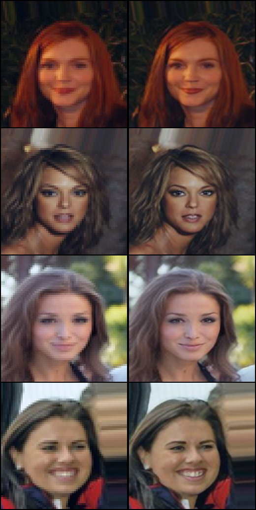
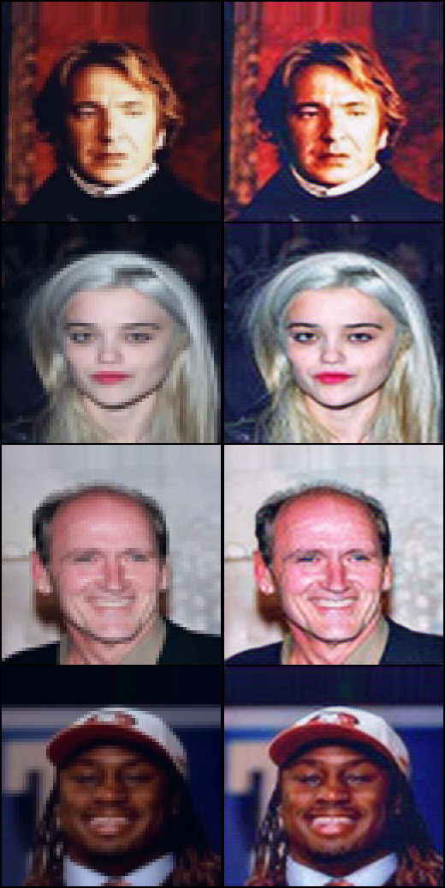

## Table of Contents
  * [Installation](#installation)
  * [Implementations](#implementations)
    + [Enhanced Super-Resolution GAN](#enhanced-super-resolution-gan)
    + [Super-Resolution GAN](#super-resolution-gan)

## Installation
    $ git clone https://github.com/dangtruong-github/SuperResolution
    $ cd SuperResolution-GAN/
    $ pip install -r requirements.txt

## Implementations   
### Enhanced Super-Resolution GAN
_ESRGAN: Enhanced Super-Resolution Generative Adversarial Networks_

#### Authors
Xintao Wang, Ke Yu, Shixiang Wu, Jinjin Gu, Yihao Liu, Chao Dong, Chen Change Loy, Yu Qiao, Xiaoou Tang

#### Abstract
The Super-Resolution Generative Adversarial Network (SRGAN) is a seminal work that is capable of generating realistic textures during single image super-resolution. However, the hallucinated details are often accompanied with unpleasant artifacts. To further enhance the visual quality, we thoroughly study three key components of SRGAN - network architecture, adversarial loss and perceptual loss, and improve each of them to derive an Enhanced SRGAN (ESRGAN). In particular, we introduce the Residual-in-Residual Dense Block (RRDB) without batch normalization as the basic network building unit. Moreover, we borrow the idea from relativistic GAN to let the discriminator predict relative realness instead of the absolute value. Finally, we improve the perceptual loss by using the features before activation, which could provide stronger supervision for brightness consistency and texture recovery. Benefiting from these improvements, the proposed ESRGAN achieves consistently better visual quality with more realistic and natural textures than SRGAN and won the first place in the PIRM2018-SR Challenge. The code is available at [this https URL](https://github.com/xinntao/ESRGAN).

[[Paper]](https://arxiv.org/abs/1809.00219) [[Code]](implementations/esrgan/esrgan.py)


#### Run Example
```
$ cd implementations/esrgan/
<follow steps at the top of esrgan.py>
$ python3 esrgan.py
```

<p align="center">
    
</p>
<p align="center">
    Nearest Neighbor Upsampling | ESRGAN
</p>

### Super-Resolution GAN
_Photo-Realistic Single Image Super-Resolution Using a Generative Adversarial Network_

#### Authors
Christian Ledig, Lucas Theis, Ferenc Huszar, Jose Caballero, Andrew Cunningham, Alejandro Acosta, Andrew Aitken, Alykhan Tejani, Johannes Totz, Zehan Wang, Wenzhe Shi

#### Abstract
Despite the breakthroughs in accuracy and speed of single image super-resolution using faster and deeper convolutional neural networks, one central problem remains largely unsolved: how do we recover the finer texture details when we super-resolve at large upscaling factors? The behavior of optimization-based super-resolution methods is principally driven by the choice of the objective function. Recent work has largely focused on minimizing the mean squared reconstruction error. The resulting estimates have high peak signal-to-noise ratios, but they are often lacking high-frequency details and are perceptually unsatisfying in the sense that they fail to match the fidelity expected at the higher resolution. In this paper, we present SRGAN, a generative adversarial network (GAN) for image super-resolution (SR). To our knowledge, it is the first framework capable of inferring photo-realistic natural images for 4x upscaling factors. To achieve this, we propose a perceptual loss function which consists of an adversarial loss and a content loss. The adversarial loss pushes our solution to the natural image manifold using a discriminator network that is trained to differentiate between the super-resolved images and original photo-realistic images. In addition, we use a content loss motivated by perceptual similarity instead of similarity in pixel space. Our deep residual network is able to recover photo-realistic textures from heavily downsampled images on public benchmarks. An extensive mean-opinion-score (MOS) test shows hugely significant gains in perceptual quality using SRGAN. The MOS scores obtained with SRGAN are closer to those of the original high-resolution images than to those obtained with any state-of-the-art method.

[[Paper]](https://arxiv.org/abs/1609.04802) [[Code]](implementations/srgan/srgan.py)

<p align="center">
    
</p>

#### Run Example
```
$ cd implementations/srgan/
<follow steps at the top of srgan.py>
$ python3 srgan.py
```

<p align="center">
    
</p>
<p align="center">
    Nearest Neighbor Upsampling | SRGAN
</p>

#### Run Example
```
$ cd implementations/wgan/
$ python3 wgan.py
```
