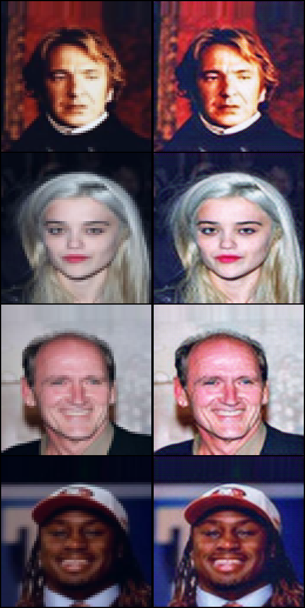

# Super-Resolution GAN
_Photo-Realistic Single Image Super-Resolution Using a Generative Adversarial Network_s

[[Paper]](https://arxiv.org/abs/1609.04802) [[Code]](implementations/srgan/srgan.py)

<p align="center">
    
</p>

## Run Example
Train
```
$ cd implementations/srgan/
<follow steps at the top of srgan.py>
$ python3 srgan.py
```
Evaluation
```
$ cd implementations/srgan/
$ python3 inference.py
```

<p align="center">
    
</p>